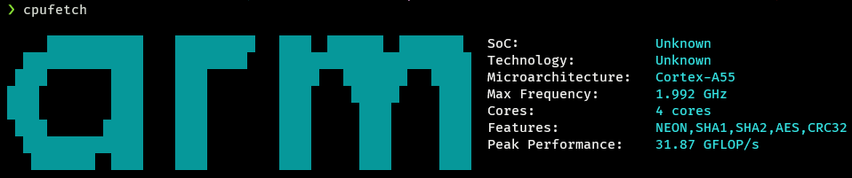
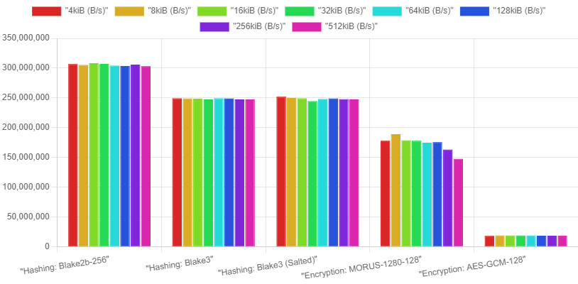

# `goro` Cryptographic Benchmark

Benchmark result for core cryptographic benchmark in `goro` ecosystem, especially in `cortex-a55` (linux embedded device)

## Cryptographic Algorithms

- Hashing: `blake2b-256` and `blake3`
- Encrypt/Decrypt: `aes-gcm-128` and `morus-1280-128`

## Result - CPU Info

## Result - Chart

